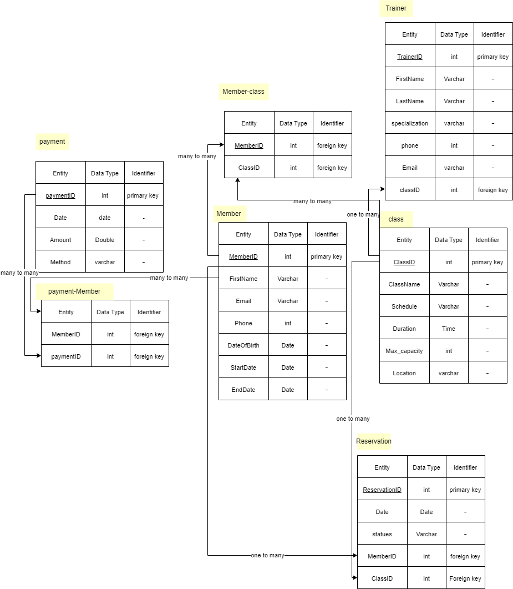
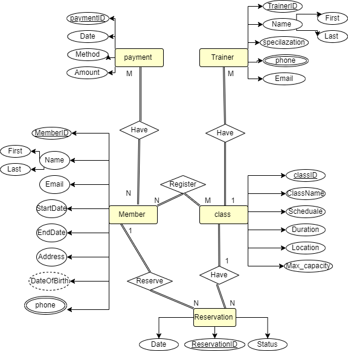

# Begin Wireframes & Software Requirements

## Admin Pages

## Player Pages

## Trainer

---

## Wireframe Link

[Figam](https://www.figma.com/file/Xs9rS0B2ol7YmEQ8HbbNjJ/Untitled?type=design&node-id=0%3A1&mode=design&t=9KgvK6iOyTw2BjJK-1)

---

## User Stories

1. As an admin, I'm the only one who is allowed to register a trainer or player

**Feature Tasks:**

- Admin-exclusive registration access for trainers and players.
- Implement a registration process that requires admin authentication.
- Display options for admin to add new trainers and players.
- Include data entry forms for trainer and player information.

**Acceptance Tests:**

- Verify that the registration process is accessible only after admin authentication.
- Ensure that non-admin users cannot access or use the registration feature.
- Confirm that data entered during registration is properly validated and stored in the database.
- Test that the admin can successfully add new trainers and players while others cannot.

2. As an admin, I want the ability to modify all trainers' and players' information.

**Feature Tasks:**

- Allow the admin to update information for both trainers and players.
- Include the ability to add or remove trainers and players from the system.
- Save changes made to trainers' and players' information.

**Acceptance Tests:**

- Ensure that modifying information does not conflict with any existing data or constraints.
- Confirm that updates to trainers' and players' information are successfully saved in the database.
- Provide appropriate error messages and abort transactions if the system becomes unavailable during the process.

3. As a Player, I want the ability to see my memberShip details and edit my own information.

**Feature Tasks:**

- Provide Player with access to view their membership details.
- Enable Player to edit their personal information.
- Implement Player authentication to ensure access is restricted to the respective Player's account.

**Acceptance Tests:**

- Verify that players can log in to their accounts securely.
- Ensure that each Player can only access and edit their own membership details.
- Confirm that membership details are accurately displayed.
- Test that Player can make changes to their personal information and those changes are saved correctly.

4. As a Trainer, I want the ability to see my profile details and edit my own information.

**Feature Tasks:**

- Provide trainers with access to view their profile details.
- Enable trainers to edit their personal information.
- Implement trainer authentication to ensure access is limited to their own account.

**Acceptance Tests:**

- Verify that trainers can log in securely to their accounts.
- Ensure that trainers can only access their own profile details.
- Confirm that the trainer's profile details are accurately displayed.
- Test that trainers can make changes to their personal information and those changes are saved correctly.

5. As a Trainer, I want the ability to see the classes I'm assigned for.

**Feature Tasks:**

- Provide trainers with access to view the classes they are assigned to.
- Display a list of classes along with relevant details such as class name, date, time, and location.
- Ensure that trainers can easily access this information from their accounts.

**Acceptance Tests:**

- Verify that trainers can log in securely to their accounts.
- Confirm that trainers can access a list of classes they are assigned to.
- Ensure that class details are accurately displayed.

## Domain modeling
### Entities

1. Member
- MemberID (int)
- FirstName (string)
- LastName (string)
- Phone (string)
- Address (string)
- DateOfBirth (date)
- StartDate (date)
- EndDate (date)

2. Class
- ClassID (int)
- ClassName (string)
- Schedule (string)
- Duration (int)
- MaxCapacity (int)
- Location (string)

3. Trainer
- TrainerID (int)
- FirstName (string)
- LastName (string)
- Specialization (string)
- Phone (string)
- Email (string)

4. Payment
- PaymentID (int)
- PaymentDate (date)
- Amount (double)
- Method (string)

5. Reservation
- ReservationID (int)
- ReservationDate (date)
- Status (string)

### Relationships
1. many members have many payments (many to many).
2. each class have many trainers (one to many).
3. many members register to many classes (many to many).
4. each member reserve many reservations (one to many ).
5. each class have many reservation (one to many).

### Diagram

## Database
1. Does a single item in your database “belong to” just one other item in your database? No
2. Does a item in your database “belong to” multiple other items in your database?  each class have many reservation (one to many),each member reserve many reservations (one to many ), each class have many trainers (one to many)..
3. Do many items in your database relate to many other items in your database? many members register to many classes (many to many), many members have many payments (many to many).

### ERD

1. Member
- MemberID (int)
- FirstName (string)
- LastName (string)
- Phone (string)
- Address (string)
- DateOfBirth (date)
- StartDate (date)
- EndDate (date)

2. Class
- ClassID (int)
- ClassName (string)
- Schedule (string)
- Duration (int)
- MaxCapacity (int)
- Location (string)

3. Trainer
- TrainerID (int)
- FirstName (string)
- LastName (string)
- Specialization (string)
- Phone (string)
- Email (string)

4. Payment
- PaymentID (int)
- PaymentDate (date)
- Amount (double)
- Method (string)

5. Reservation
- ReservationID (int)
- ReservationDate (date)
- Status (string)
## Estimates for User Stories:

1. Admin-exclusive registration access for trainers and players.

- Estimate: Large (6-12 hours)

2. Ability for admin to modify all trainers' and players' information.

- Estimate: Small (2-4 hours)

3. Player's ability to see membership details and edit personal information.

- Estimate: Small (2-4 hours)

4. Trainer's ability to see profile details and edit personal information.

- Estimate: Small (2-4 hours)

5. Trainer's ability to see assigned classes.

- Estimate: Small (2-4 hours)

